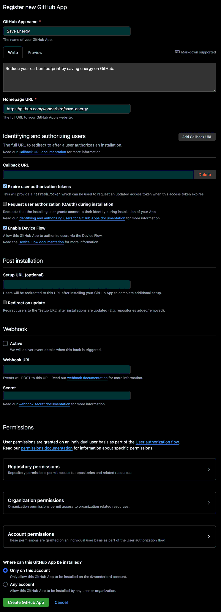

# Authentication Setup

Detailed background information is linked at the bottom of this document.

Because the application authenticates with the GitHub API as a GitHub App, you need to create a corresponding GitHub
App in the [developer settings of your GitHub account](https://github.com/settings/apps/). This screenshot shows the detailed configuration:



At the moment, the application does not require any permissions.

To authenticate with the GitHub API, the application receives the **Client Id** from the `dotnet user-secrets`
configuration helper.

You can configure the Client Id as a secret using the following commands:

```shell
cd src/SaveEnergy
dotnet user-secrets set "GitHub:ClientId" "YOUR_CLIENT_ID"
cd ../..
```

`dotnet user-secrets` will store the Client Id in
`~/.microsoft/usersecrets/5423f1ff-336c-429f-9498-7700b2de9ebb/secrets.json`. The GUID is taken from
[SaveEnergy.csproj](./src/SaveEnergy/SaveEnergy.csproj).

## References and Detailed Information

- [Authenticating to the REST API](https://docs.github.com/en/rest/authentication/authenticating-to-the-rest-api)
- [Authenticating with a GitHub App on behalf of a user](https://docs.github.com/en/apps/creating-github-apps/authenticating-with-a-github-app/authenticating-with-a-github-app-on-behalf-of-a-user)
- [Generating a user access token for a GitHub App](https://docs.github.com/en/apps/creating-github-apps/authenticating-with-a-github-app/generating-a-user-access-token-for-a-github-app)
- [Registering a GitHub App](https://docs.github.com/en/apps/creating-github-apps/registering-a-github-app/registering-a-github-app)
- [Safe storage of app secrets in development in ASP.NET Core](https://learn.microsoft.com/en-us/aspnet/core/security/app-secrets)
